# Projeto Educacional de Criação de um Jogo de Detetive com Raspberry Pi e Python

Um dos grandes problemas que vimos é que é difícil para uma pessoa iniciante saber o que  estudar para começar. Há material disponível gratuito mas desconexo que precisa ser juntado da maneira correta. Por isso aqui, nós monstamos tutoriais e outros recursos mostrando como fazer o projeto. Mas para os conhecimentos de pré-requisitos, o que fizemos foi buscar materiais bons, já existentes de forma gratuita e organizamos aqui para vocês.

Este projeto foi montado usando um Raspberry Pi 4, linguagem Python e uma base SQLite. Então você vai precisar saber um pouco de python, bem pouco de configuração de um Raspberry Py e um mínimo de SQL. Então aqui em baixo temos alguns links para vocês estudarem antes de começarem o projeto se ainda não conhecerem esses assuntos.

# Para usar nosso projeto você precisará de conhecimentos de:
- Python: 
    - [Curso Gratuito de Python Curso em Vídeo Gustavo Guanabara Módulo 1](https://www.youtube.com/watch?v=S9uPNppGsGo&list=PLHz_AreHm4dlKP6QQCekuIPky1CiwmdI6)
    - [Curso Gratuito de Python Curso em Vídeo Gustavo Guanabara Módulo 2](https://www.youtube.com/watch?v=nJkVHusJp6E&list=PLHz_AreHm4dk_nZHmxxf_J0WRAqy5Czye)
    - [Curso Gratuito de Python Curso em Vídeo Gustavo Guanabara Módulo 3](https://www.youtube.com/watch?v=0LB3FSfjvao&list=PLHz_AreHm4dksnH2jVTIVNviIMBVYyFnH)

    - **Requisitos mínimos:** variáveis, funções, tipos de dados, coleções, estrutras condicionais, estruturas de repetição (laços), classes e objetos

- Básico de SQL 
    - [Curso Gratuito de MySQL Curso em Vídeo Gustavo Guanabara](https://www.youtube.com/watch?v=Ofktsne-utM&list=PLHz_AreHm4dkBs-795Dsgvau_ekxg8g1r) - Ah, mas este não é de SQLite. Não se preocupe. Os comandos e ideias são os mesmos. Apenas a sintaxe é um pouco diferente. Mas você vai conseguir acompanhar tranquilamente. o SQLite é mais simples que o MySQL, permite menos coisas, mas eu vou falar disso quando falar da base de dados.
    - **Requisitos mínimos:** SELECT, JOIN, WHERE

- Básico de configuração de Raspberry Pi: 
    - [Curso Gratuito de Raspberry Pi Curso em Vídeo Gustavo Guanabara](https://www.youtube.com/watch?v=CbIeFxsfgzk&list=PLHz_AreHm4dnGZ_nudmN4rvyLk2fHFRzy&index=2)   

    - [Curso Gratuito de Raspberry Pi do Brincando com ideias](https://www.youtube.com/watch?v=VcZ-vBWqFbg&list=PL7CjOZ3q8fMc7J7aoYrvza52URffS6WRq&index=9) - este curso está mais antigo mas o que achei melhor do que o outro curso foi a explicação do GPIO. Os vídeos 8 e 10. Então recomendo assistir ao curso do Gustavo Guanabara para configuração do Raspberry Pi e depois assistir os vídeos 8 e 10 deste curso para entender o GPIO.
     - **Requisitos mínimos:** Instalação e configuração do Raspberry Pi OS, instalação de bibliotecas Python, configuração de GPIO

    - Boa explicação de PULL-UP e PULL-DOWN - [Como Ligar Botões No Raspberry Pi Resistores Pull Up Down](https://www.youtube.com/watch?v=dQ8iT-skWxQ)

# Recursos

- [Playlist com dicas relevantes]()
- [Playlist com tutoriais]()

- [Site com os pinos do Raspberry Pi](https://pinout.xyz/)
- Pinagem: 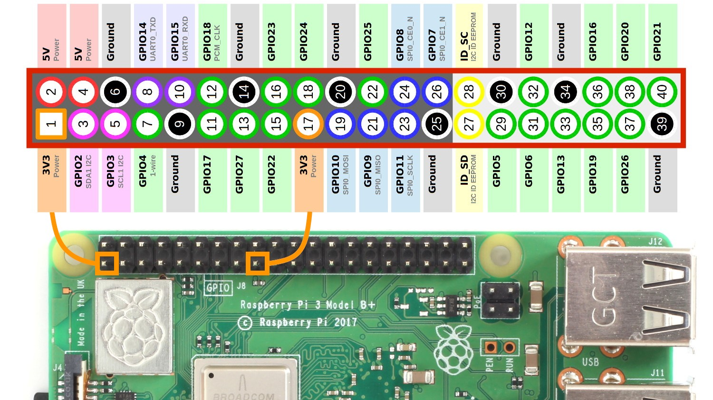

- [Documentação Raspberry Pi](https://www.raspberrypi.org/documentation/)

- [Raspberry Pi Imager e Download do Sistema Operacional](https://www.raspberrypi.com/software/)

- [Site Orange Pi](http://www.orangepi.org/)

- [Site BanaPi](https://www.banana-pi.org/)

- [Documentação Biblioteca Python Rpi.GPIO](https://pypi.org/project/RPi.GPIO/)

- [Documentação da biblioteca Tkinter](https://docs.python.org/3/library/tkinter.html)

- [Documentação da biblioteca sqlite3](https://docs.python.org/3/library/sqlite3.html)
- [SQLite Download](https://www.sqlite.org/download.html)
- [Documentação PyInstaller](https://pyinstaller.org/en/stable/)

- [Download DBeaver](https://dbeaver.io/download/)

- [MySQL Workbench](https://dev.mysql.com/downloads/workbench/)
- [Adobe Colors](https://color.adobe.com/pt/create/color-wheel)
- [Gerador de favicon - Favicon.cc](https://www.favicon.cc/)
- [Gerador de favicon - Favicon-generator](https://www.favicon-generator.org/)
- [Inno Setup](https://jrsoftware.org/isinfo.php)

# Índice dos vídeos tutoriais
## Seção 01 - Apresentação do Projeto
- [Aula 01 - Apresentação]()
- [Aula 02 - Explicando como ensino]()
- [Aula 03 - Apresentando os recursos]()
- [Aula 04 - Porque o nome Zefa]()
## Seção 02 - Apresentação da Lógica do Jogo
- [Aula 05 - Apresentacao resultado final jogo]()
- [Aula 06- Instalando SQLite]()
- [Aula 07 - Lógica da base de dados]()
## Seção 03 - Apresentando e Alterando a base de dados
- [Aula 08 - Alterando a de dados]()
## Seção 04 - Modelo - Lógica da criação do Jogo
- [Aula 09 - Apresentando o código]()
- [Aula 10 - Conectando na base de dados]()
- [Aula 11 - Lendo a Base]()
- [Aula 12 - Classe Cidade]()
- [Aula 13 - Classe Local]()
- [Aula 14 - Classe Jogo]()
- [Aula 15 - Classe Jogo - CriarPistasCidades]()
- [Aula 16 - Classe Jogo - Criar Pistas Cidade Falsa e Final]()
- [Aula 17 - Classe Jogo - Criar Destinos]()
## Seção 05 - Visualização e Fluxo de Jogo na Linha de Comando
- [Aula 18 - Fluxo de Jogo na Linha de Comando]()
## Seção 06 - Visualização e Fluxo de Jogo na Interface de Desktop (Computador)
## Seção 07 - Visualização e Fluxo de Jogo na Interface para Raspberry Pi com Botões
## Seção 08 - Criando o executável e instalador

# Hardware usado nos projetos

Os links foram colocados só para mostrar onde eu comprei, mas não é recomendação. Pesquise e compre onde e qual achar melhor.

- [Display Touch HDMI 7"](https://pt.aliexpress.com/item/1005001485174459.html?spm=a2g0o.order_list.order_list_main.5.21efcaa4HUiFeB&gatewayAdapt=glo2bra) 
- Raspberry Pi 4 8GB
- SD Card 32GB
- Fonte 5V 3A
- 6 Botões
- Protoboard
- Jumpers
- Cabo USB
- Cabo HDMI

# Conexão Botões

- Esquemático: 
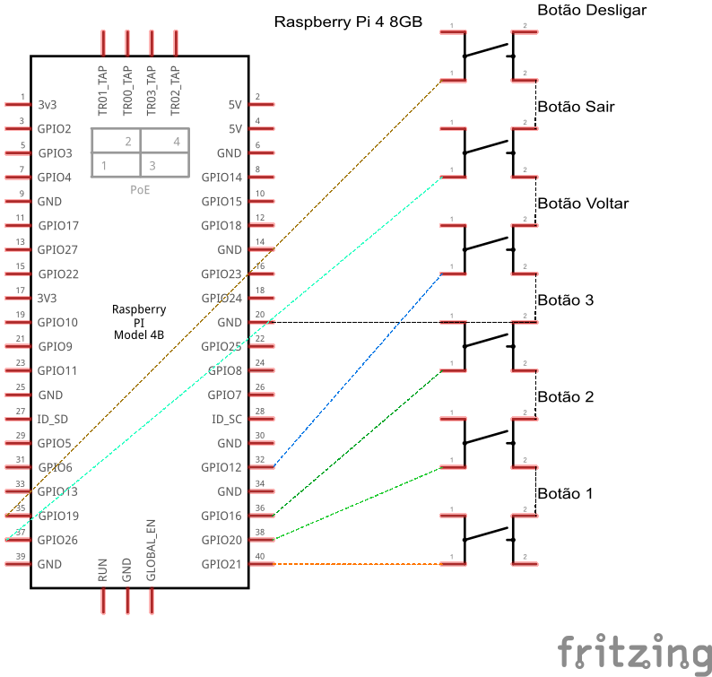

- Protoboard: 


# Instalação do Sistema Operacional

1. Abra o navegador e vá até: https://www.raspberrypi.com/software/
2. Baixe a versão do imager par seu sistema operacional.
3. Abra o imager e conecte o SD Card no seu computador.
4. Clique em Choose OS e escolha a versão do Raspbery Pi OS que está em primeiro lugar e que tem a descrição "Recommended".
5. Clique em Choose Storage e escolha o SD Card que você conectou.
6. Clique na engrenagem para qualquer configuração adicional que você queira fazer como habilitar o SSH ou já deixar definido o usuário e senha. Este passo é opcional.
7. Clique em Write e aguarde a gravação do sistema operacional no SD Card.
8. Quando terminar, conecte o SD Card no Raspberry Pi e ligue ele na tomada.
9. Siga o passo a passo da configuração do sistema operacional. Não vou colocar aqui pois ele tem a tendência de mudar com o tempo. Você pode ver o vídeo para ver como é o processo. Mas não se preocupe. É bem simples.
10. Uma vez que o sistema estiver configurado, siga no passo abaixo para a instalação das bibliotecas Python que vamos usar no projeto.


# Instalação das bibliotecas

Nós vamos usar algumas bibliotecas do Python que não vem pré-instaladas. Não se preocupe. Não são dificeis de instalar. Vamos lá.

>Aqui temos uma ressalva importante. Vamos poder usar o comando pip globalmente no Window, Mac e maioria dos Linux mas não no Raspberry Pi. As instruções para Raspberry Pi estão logo abaixo. 
## Windows, Linux, Mac

Nós iremos usar o haversine para calcular as distâncias. Para isso, abra o terminal do Raspberry Pi ou do seu computador e digite:

No Windows, Mac ou Ubuntu use:
```bash
pip install haversine
``` 

E vamos usar a biblioteca abaixo para criar o executável final:

No Windows, Mac ou Ubuntu use:
```bash	
pip install pyinstaller
```
## Raspberry Pi OS Bookworm para cima

Você precisará criar um ambiente virtual para rodar o python separado do python do sistema. Para abra o terminal e navegue até a pasta onde você quer criar o ambiente virtual. O ideal é criar um ambiente virtual para cada projeto. Em geral a prática é criar a mesma pasta do projeto. Uma vez nesta pasta, digite:

```bash
python -m venv nomeAmbienteVirtual
```
O nome pode ser o que você quiser. Em geral é usado o nome venv. Mas você pode usar o nome que quiser. 

Você perceberá que será criada uma pasta com o nome que você escolheu. Naguegue até ela com


```bash
cd nomeAmbienteVirtual
```
Agora você precisa ativar o ambiente virtual. Digite:

```bash
source bin/activate
```

Isto deve ter feito com que de agora em diante, quando você digitar python, ele use o python do ambiente virtual e não o do sistema. Para testar, digite:

```bash
which python
```

Deveria ter retornado algo como:

```bash
/home/seuUsuario/nomeAmbienteVirtual/bin/python
```
Basicamente, o caminho para o Python na pasta bin do ambiente virtual que você criou. Se ainda estiver usando o do sistema vai retornar.

```bash
/usr/bin/python
```

Se tiver dado tudo certo agora você pode usar o comando pip normalmente. Para instalar o heversine digite:

```bash
pip install haversine
```
E vamos precisar a biblioteca para controlar o GPIO
```bash
pip install RPi.GPIO
```
# Instalação driver SQLite

Vamos precisar instalar os drivers do SQLite. No Raspberry Pi ou Linux em geral abra o terminal e digite:

```bash
sudo apt install sqlite3
```

No Windows, você precisa:
- Baixar o executável do SQLite no site oficial: https://www.sqlite.org/download.html
- Extrair tudo. 
- Renomear a pasta para SQLite3 e transferir para a raiz do disco C.
- Adicionar o caminho da pasta as Variáveis de Ambientes Path.
Pronto. Temos todo o ambiente de desenvolvimento que vamos precisar.

# Requisitos Funcionais de Programação
- RF 01 – O sistema deve criar um caso para o jogo com nove cidades, sendo uma a cidade inicial, uma a final, e três cidades de pistas falsas de forma aleatória.
- RF 02 - O sistema deve permitir ao usuário investigar, visualizar os destinos e viajar.
- RF 03 - O sistema deve permitir ao usuário escolher uma opção de 3.
- RF 04 - O sistema deve calcular o tempo de viagem para cada escolha.
- RF 05 - O sistema deve informar ao usuário se ele capturou a Zefa ou não.
- RF 06 - O sistema deve deduzir o número de horas gastos em deslocamentos e dormir do número de horas totais disponíveis.
- RF 07 - O sistema deve permitir ao usuário se deslocar para os locais de investigação em cada cidade.
- RF 08 - O sistema deve permitir ao usuário viajar para outros países.
- RF 09 - O sistema deve permitir ao usuário visualizar os destinos possíveis.
- RF 10 - O sistema deve permitir ao usuário capturar a Zefa.
- RF 11 - O sistema deve permitir ao usuário voltar ao menu anterior.
- RF 12 – O sistema deve permitir ao usuário gerar um novo jogo.

# Requisitos Não Funcionais de Programação

- RNF 01 - O sistema deve ser capaz de rodar em um Raspberry Pi 3B+.
- RNF 02 - O sistema deve ser criado em Python.
- RNF 03 - O sistema deve ter no máximo seis botões.
- RFN 04 – O sistema deve ser criado em três versões de possibilidade de entradas e saídas: Linha de Comando, Display 7” com seis botões, Desktop com interface gráfica 
- RFN 05 - O sistema deve permitir escolhas simplesmente com os seis botões.


# Diagrama da Base de Dados

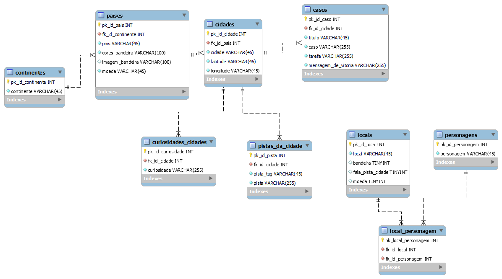

# Diagrama de Classes


# Diagrama de atividades da classe Jogo na criação do caso


# Diagrama de atividades do fluxo de jogo

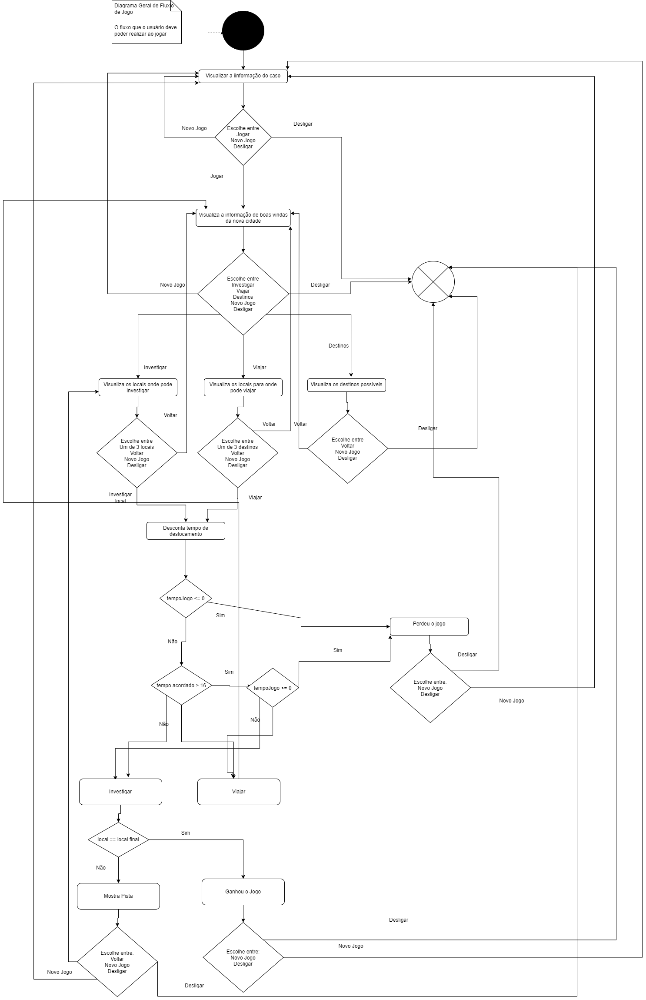

# Roteiro de destinos
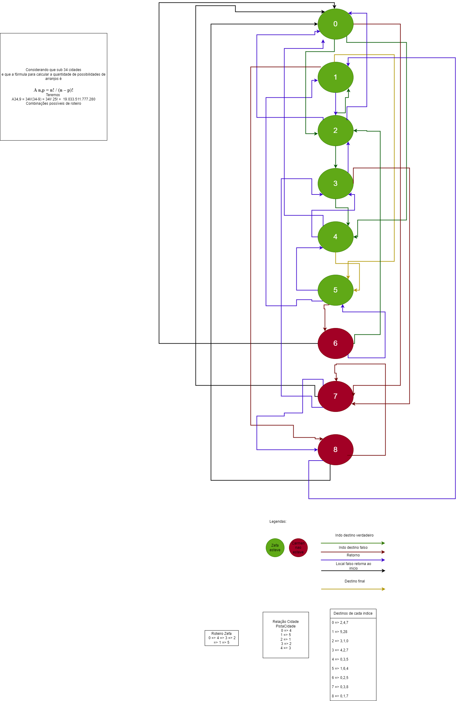

# Imagens do projeto funcionando

## Display de 7" com jogo funcionando

**Protoboard, placa adaptadora Raspberry Pi, 6 botões e Display HDMI 7” com Jogo funcionando**
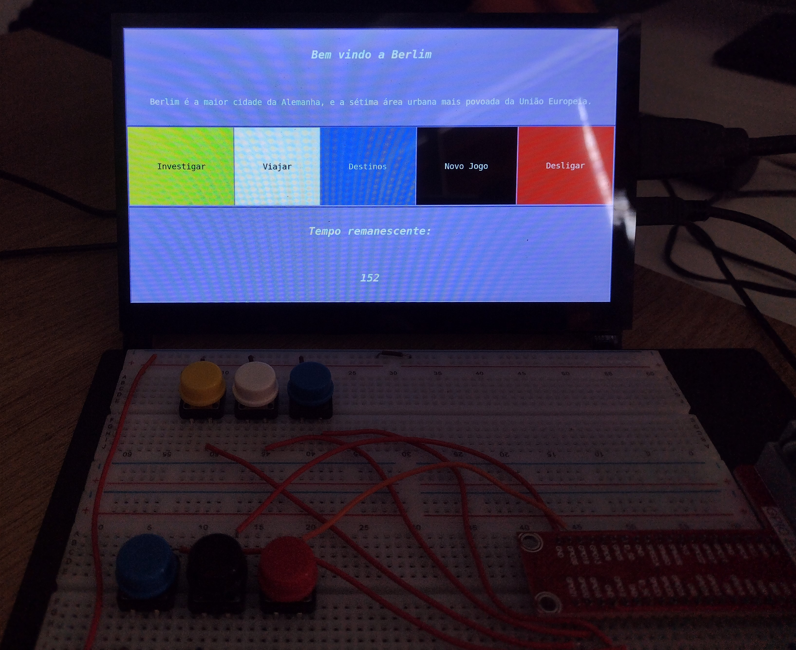
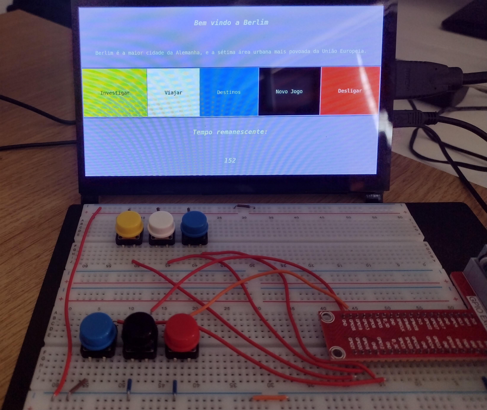

**Raspberry Pi 4 8GB em case dissipador de calor**
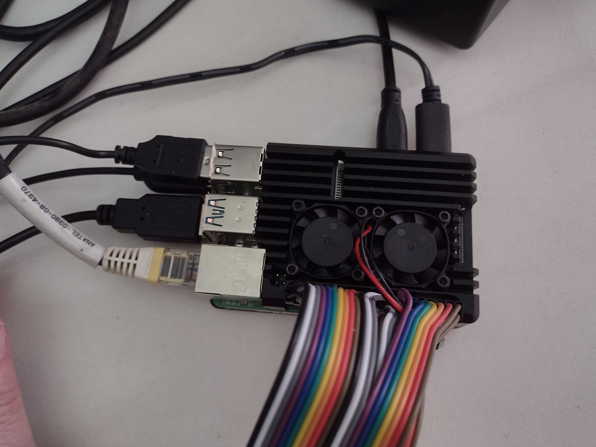

**Protoboard, placa adaptadora Raspberry Pi, 6 botões**
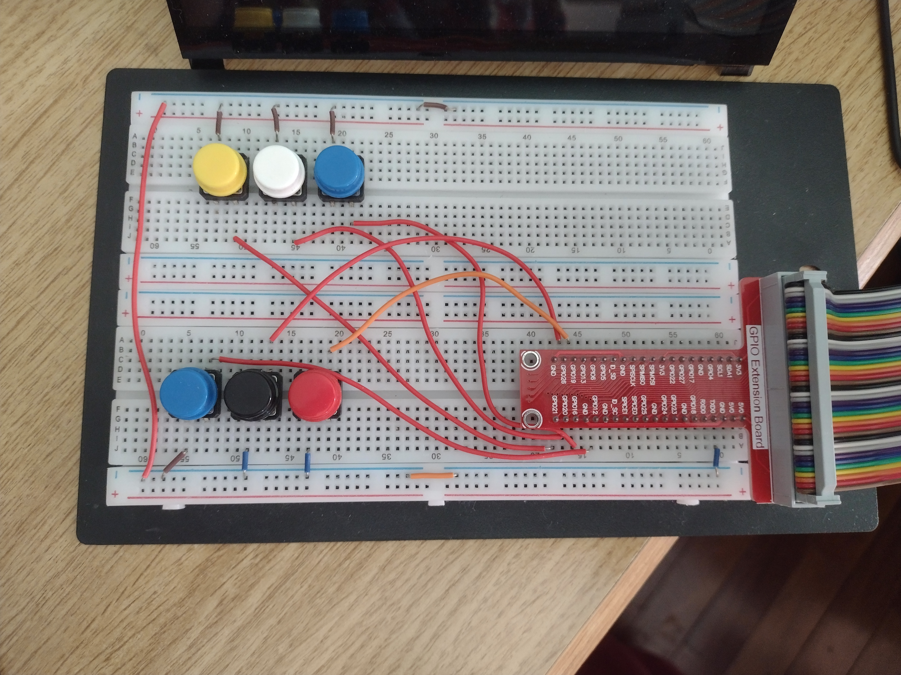

**Protoboard, placa adaptadora Raspberry Pi, 6 botões**
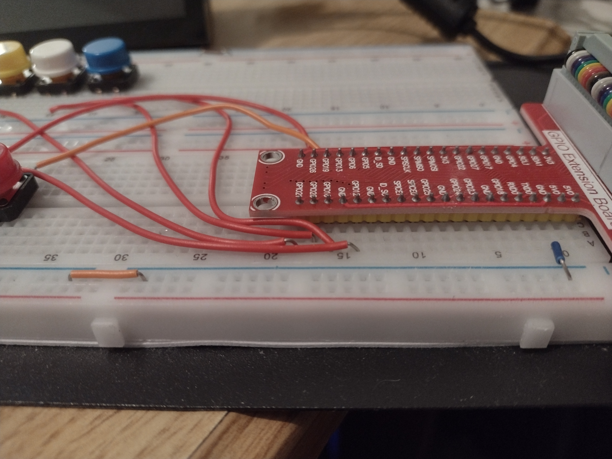


## Prints do jogo
**Tela Inicial**
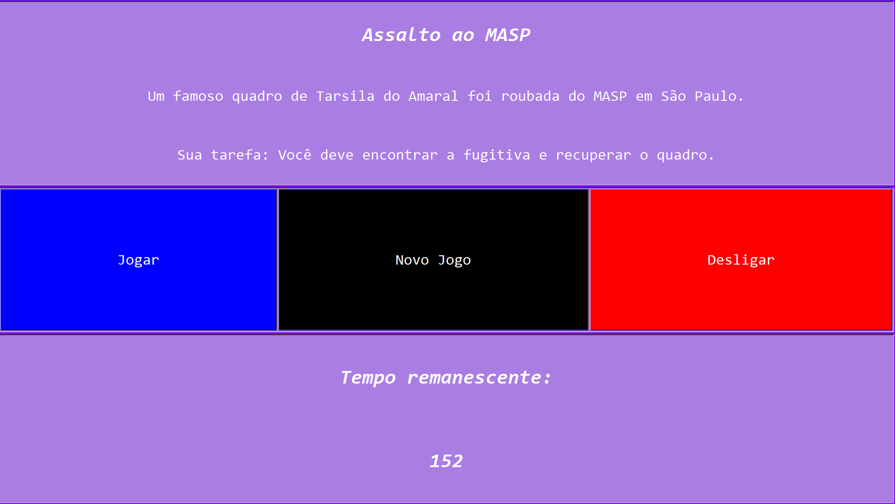

**Menu principal do Jogo**
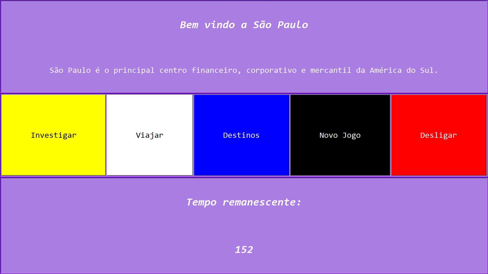

**Tela Investigar**
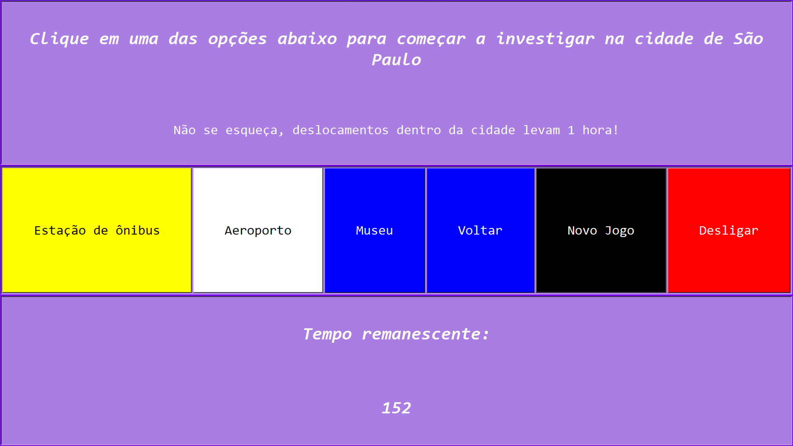

**Tela Pista**
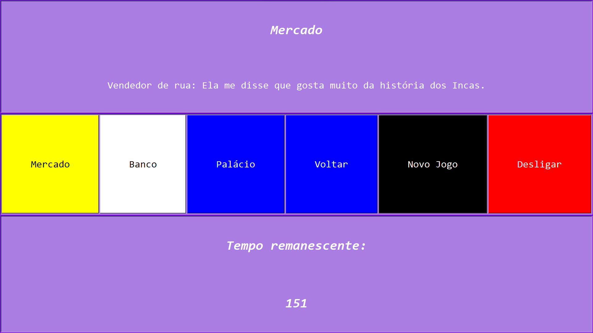

**Tela Viajar**
 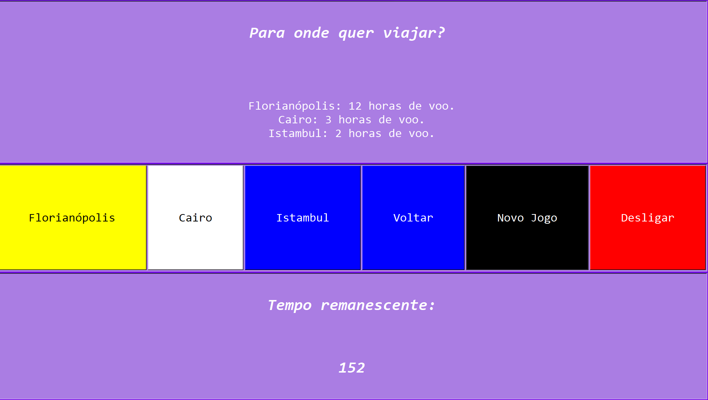

**Tela Destinos**
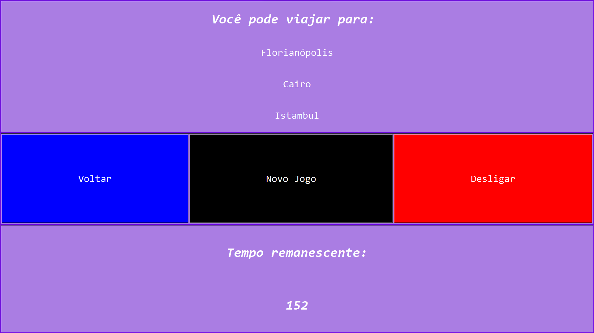

**Tela Final**
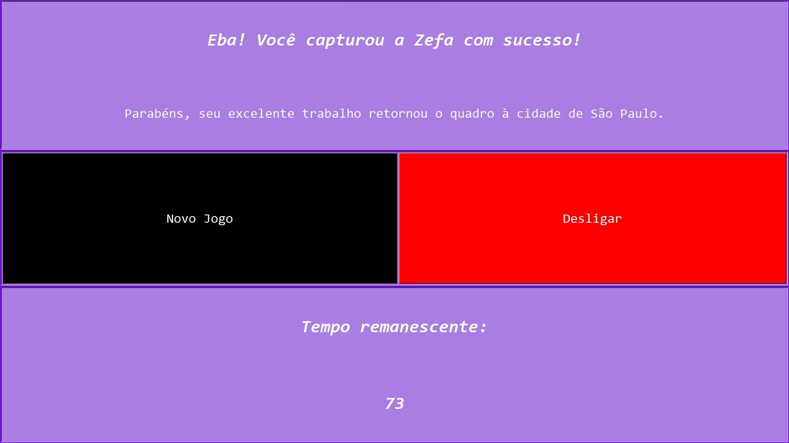


## Criando o executável

Caso você queira criar um instalador, você precisará criar um executável. Para isso, por favor assista este vídeo: 


No seu projeto você vai precisar abrir a linha de comando e rodar:

```bash	
pyinstaller --name CadeAZefa --onefile -w --icon=zefa.ico main.py  --hidden-import Controller.FluxoDeJogoComp  --hidden-import View.Computador.InfoComEscolha --hidden-import View.Computador.InfoSemEscolha --hidden-import View.Computador.Info --hidden-import View.Computador.Menu --hidden-import View.Computador.Inicio --hidden-import haversine --hidden-import Model.Local --hidden-import Model.Cidade --hidden-import Moel.Jogo --hidden-import Model.ConexaoBD --hidden-import View.Computador.Computador
```

