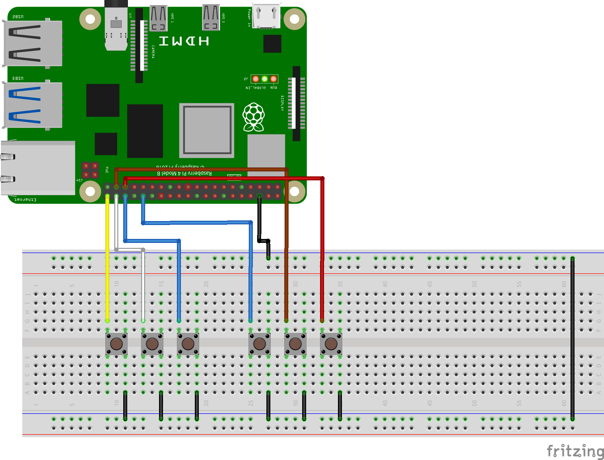
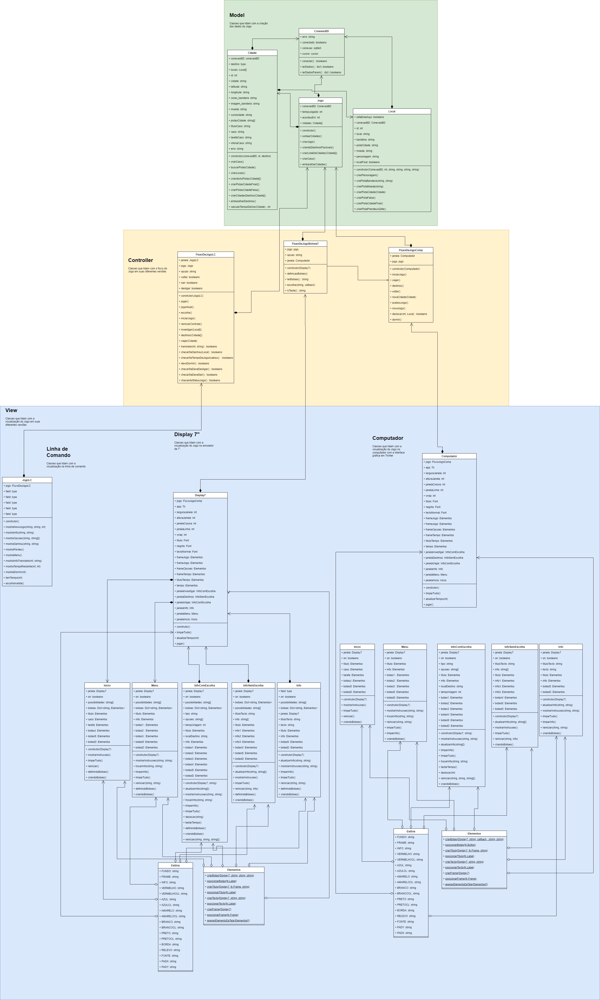
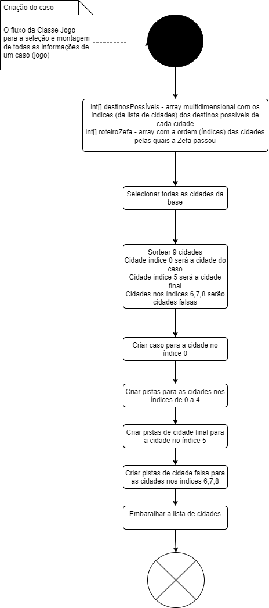
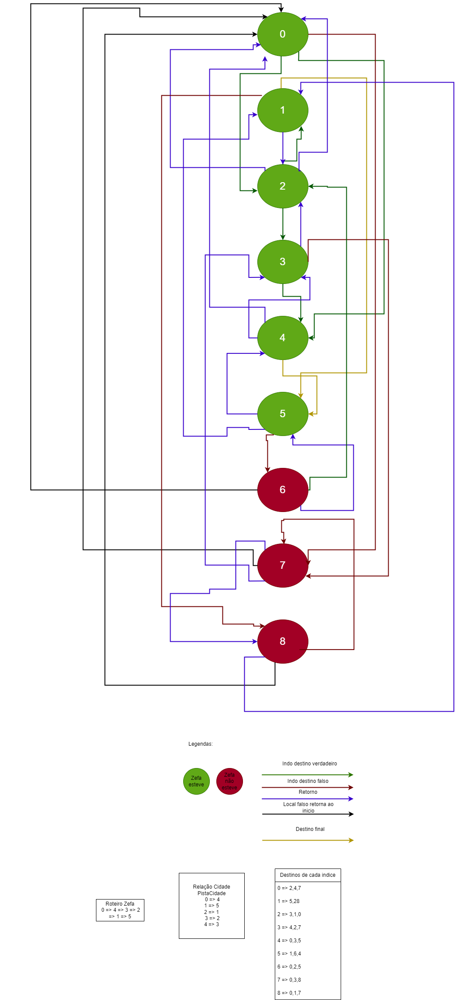

# Projeto Educacional de Criação de um Jogo de Detetive com Raspberry Pi e Python

Um dos grandes problemas que vimos é que é difícil para uma pessoa iniciante saber o que  estudar para começar. Há material disponível gratuito mas desconexo que precisa ser juntado da maneira correta. Por isso aqui, nós monstamos tutoriais e outros recursos mostrando como fazer o projeto. Mas para os conhecimentos de pré-requisitos, o que fizemos foi buscar materiais bons, já existentes de forma gratuita e organizamos aqui para vocês.

Este projeto foi montado usando um Raspberry Pi 4, linguagem Python e uma base SQLite. Então você vai precisar saber um pouco de python, bem pouco de configuração de um Raspberry Py e um mínimo de SQL. Então aqui em baixo temos alguns links para vocês estudarem antes de começarem o projeto se ainda não conhecerem esses assuntos.

# Para usar nosso projeto você precisará de conhecimentos de:
- Python: 
    - [Curso Gratuito de Python Curso em Vídeo Gustavo Guanabara Módulo 1](https://www.youtube.com/watch?v=S9uPNppGsGo&list=PLHz_AreHm4dlKP6QQCekuIPky1CiwmdI6)
    - [Curso Gratuito de Python Curso em Vídeo Gustavo Guanabara Módulo 2](https://www.youtube.com/watch?v=nJkVHusJp6E&list=PLHz_AreHm4dk_nZHmxxf_J0WRAqy5Czye)
    - [Curso Gratuito de Python Curso em Vídeo Gustavo Guanabara Módulo 3](https://www.youtube.com/watch?v=0LB3FSfjvao&list=PLHz_AreHm4dksnH2jVTIVNviIMBVYyFnH)

    - **Requisitos mínimos:** variáveis, funções, tipos de dados, coleções, estrutras condicionais, classes e objetos

- Básico de SQL 
    - [Curso Gratuito de MySQL Curso em Vídeo Gustavo Guanabara](https://www.youtube.com/watch?v=Ofktsne-utM&list=PLHz_AreHm4dkBs-795Dsgvau_ekxg8g1r) - Ah, mas este não é de SQLite. Não se preocupe. Os comandos e ideias são os mesmos. Apenas a sintaxe é um pouco diferente. Mas você vai conseguir acompanhar tranquilamente. o SQLite é mais simples que o MySQL, permite menos coisas, mas eu vou falar disso quando falar da base de dados.
    - **Requisitos mínimos:** SELECT, JOIN, WHERE

- Básico de configuração de Raspberry Pi: 
    - [Curso Gratuito de Raspberry Pi Curso em Vídeo Gustavo Guanabara](https://www.youtube.com/watch?v=CbIeFxsfgzk&list=PLHz_AreHm4dnGZ_nudmN4rvyLk2fHFRzy&index=2)   

    - [Curso Gratuito de Raspberry Pi do Brincando com ideias](https://www.youtube.com/watch?v=VcZ-vBWqFbg&list=PL7CjOZ3q8fMc7J7aoYrvza52URffS6WRq&index=9) - este curso está mais antigo mas o que achei melhor do que o outro curso foi a explicação do GPIO. Os vídeos 8 e 10. Então recomendo assistir ao curso do Gustavo Guanabara para configuração do Raspberry Pi e depois assistir os vídeos 8 e 10 deste curso para entender o GPIO.
     - **Requisitos mínimos:** Instalação e configuração do Raspberry Pi OS, instalação de bibliotecas Python, configuração de GPIO

    - Boa explicação de PULL-UP e PULL-DOWN - [Como Ligar Botões No Raspberry Pi Resistores Pull Up Down](https://www.youtube.com/watch?v=dQ8iT-skWxQ)

# Recursos

- [Playlist com dicas relevantes]()
- [Playlist com tutoriais]()
- [Site com os pinos do Raspberry Pi](https://pinout.xyz/)
- Pinagem: 

- [Documentação Raspberry Pi](https://www.raspberrypi.org/documentation/)

- [Raspberry Pi Imager e Download do Sistema Operacional](https://www.raspberrypi.com/software/)

- [Documentação Biblioteca Python Rpi.GPIO](https://pypi.org/project/RPi.GPIO/)

- [Documentação da biblioteca Tkinter](https://docs.python.org/3/library/tkinter.html)

- [Documentação da biblioteca sqlite3](https://docs.python.org/3/library/sqlite3.html)

- [Documentação PyInstaller](https://pyinstaller.org/en/stable/)
- [Download DBeaver](https://dbeaver.io/download/)

- [MySQL Workbench](https://dev.mysql.com/downloads/workbench/)

# Hardware usado nos projetos

Os links foram colocados só para mostrar onde eu comprei, mas não é recomendação. Pesquise e compre onde e qual achar melhor.

- [Display Touch HDMI 7"](https://pt.aliexpress.com/item/1005001485174459.html?spm=a2g0o.order_list.order_list_main.5.21efcaa4HUiFeB&gatewayAdapt=glo2bra) 
- Raspberry Pi 4 8GB
- SD Card 32GB
- Fonte 5V 3A
- 6 Botões
- Protoboard
- Jumpers
- Cabo USB
- Cabo HDMI

# Conexão Botões

- Esquemático: 


- Protoboard: 



# Instalação do Sistema Operacional

1. Abra o navegador e vá até: https://www.raspberrypi.com/software/
2. Baixe a versão do imager par seu sistema operacional.
3. Abra o imager e conecte o SD Card no seu computador.
4. Clique em Choose OS e escolha a versão do Raspbery Pi OS que está em primeiro lugar e que tem a descrição "Recommended".
5. Clique em Choose Storage e escolha o SD Card que você conectou.
6. Clique na engrenagem para qualquer configuração adicional que você queira fazer como habilitar o SSH ou já deixar definido o usuário e senha. Este passo é opcional.
7. Clique em Write e aguarde a gravação do sistema operacional no SD Card.
8. Quando terminar, conecte o SD Card no Raspberry Pi e ligue ele na tomada.
9. Siga o passo a passo da configuração do sistema operacional. Não vou colocar aqui pois ele tem a tendência de mudar com o tempo. Você pode ver o vídeo para ver como é o processo. Mas não se preocupe. É bem simples.
10. Uma vez que o sistema estiver configurado, siga no passo abaixo para a instalação das bibliotecas Python que vamos usar no projeto.


# Instalação das bibliotecas

Nós vamos usar algumas bibliotecas do Python que não vem pré-instaladas. Não se preocupe. Não são dificeis de instalar. Vamos lá.

>Aqui temos uma ressalva importante. Use o comando pip e não pip3. O pip3 roda mas ele instala as bibliotecas em um ambiente virtual que ele cria e não onde o Raspberry Pi OS procura. 

Nós iremos usar o haversine para calcular as distâncias. Para isso, abra o terminal do Raspberry Pi ou do seu computador e digite:

```bash
sudo pip install haversine
``` 

E vamos usar a biblioteca abaixo para criar o executável final:
```bash	
sudo pip install -U pyinstaller
```


Além disso vamos precisar instalar os drivers do SQLite. No Raspberry Pi ou Linux em geral. Para isso, abra o terminal do Raspberry Pi e digite:

```bash
sudo apt install sqlite3
```

No Windows, você precisa:
- Baixar o executável do SQLite no site oficial: https://www.sqlite.org/download.html
- Extrair tudo. 
- Renomear a pasta para SQLite3 e transferir para a raiz do disco C.
- Adicionar o caminho da pasta as Variáveis de Ambientes Path.
Pronto. Temos todo o ambiente de desenvolvimento que vamos precisar.

# Diagrama da Base de Dados


# Diagrama de Classes



# Diagrama de atividades da classe Jogo na criação do caso



# Diagrama de atividades do fluxo de jogo


# Roteiro de destinos


# Imagens do projeto funcionando

## Display de 7" com jogo funcionando

**Protoboard, placa adaptadora Raspberry Pi, 6 botões e Display HDMI 7” com Jogo funcionando**


**Raspberry Pi 4 8GB em case dissipador de calor**


**Protoboard, placa adaptadora Raspberry Pi, 6 botões**


## Prints do jogo
**Tela Inicial**


**Menu principal do Jogo**


**Tela Investigar**


**Tela Pista**


**Tela Viajar**
 

**Tela Destinos**


**Tela Final**


